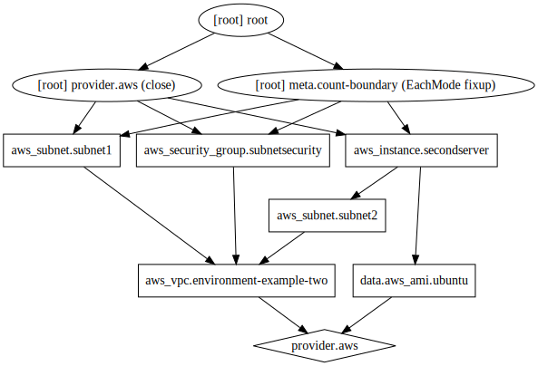

# terraform-lil
Leaning course work

config `aws configure ` first


* [create vpc](/doc/vpc/readme.md)
* [subnet-securitygroup](/doc/subnet-securitygroup/readme.md)
* [vm](/doc/vm/readme.md)
* [workspace](/doc/workspace/readme.md)
* [variable](/doc/variable/readme.md)
* [s3](/doc/s3/readme.md)
* [caffee_type](/doc/caffee_type/readme.md)

---
#### terraform init
#### terraform validate
#### terraform fmt
#### terraform destroy
#### terraform state (terraform state show aws_instance.secondserver)
#### terraform output
#### terraform import
#### terraform force-unlock
#### terraform refresh
#### terraform taint aws_subnet.subnet1
#### terraform untaint aws_subnet.subnet1


---
#### brew install GraphViz
add ```export LDFLAGS="-L/usr/local/opt/libffi/lib"``` to  ~/.bash_profile 
#### terraform graph | dot -Tsvg > graph.svg

---

add ```export TF_LOG=TRACE``` into .bash_profle to debug
