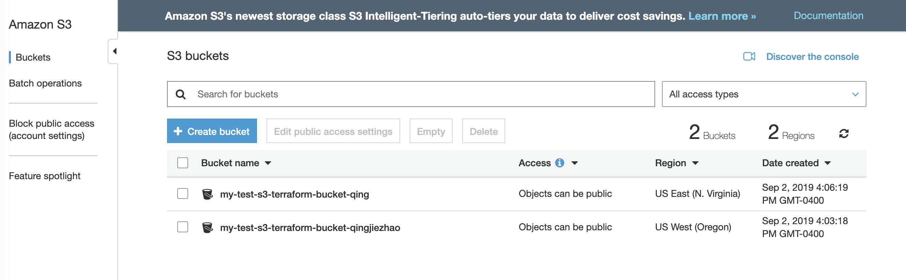

connection.tf
```
provider "aws" {
  region = "us-east-1"
}
```
resources.tf
```
resource "aws_s3_bucket" "example" {

  bucket = "my-test-s3-terraform-bucket-qingjie"
  acl    = "private"
  versioning {
    enabled = true
  }

  tags = {
    Name = "my-test-s3-terraform-bucket-qingjie"
  }

}
```



